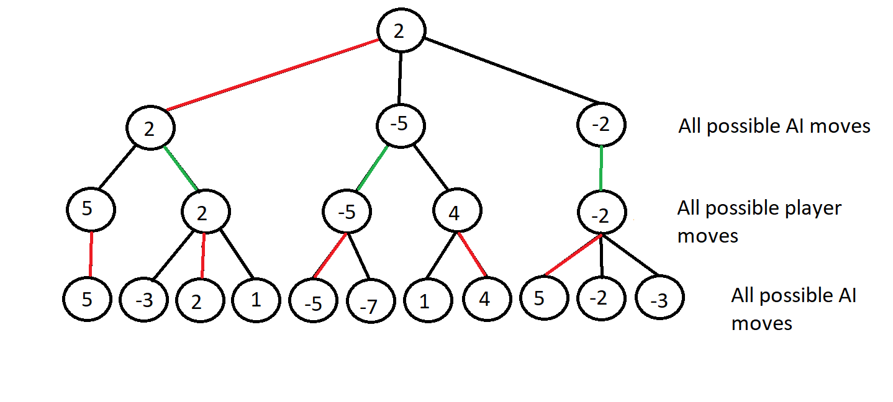
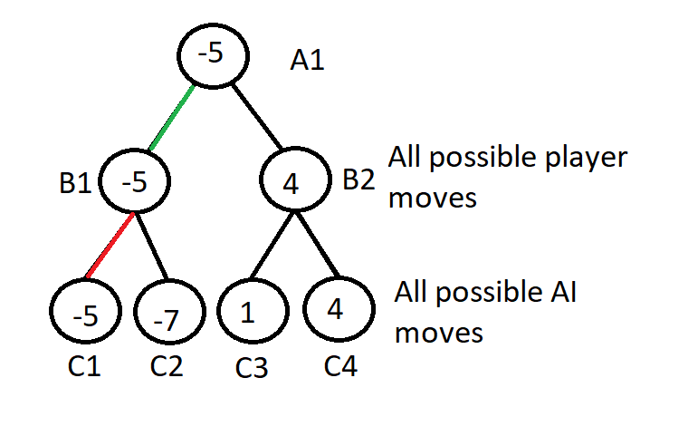

# Chess-AI

## About the game

This game is a version of the game chess but with a small twist, all the pieces are based on swedish people. The origin of chess isn't completely known but it has existed for approximately 2000 years. It is played with two players, one on each side of a 8x8 board. Each player starts with a total of 16 pieces where each piece have a different set of legal moves. If a player's piece lands on the opponent's piece, then the latter is removed from the board. The game is ended when one person get's checkmate, meaning that the opponent's king is threatened and the opponent can't remove the threat.

In this game you will play against the computer in a difficulty of your choosing. Let the best king win!

## About the project

The purpose with this project was to learn how to implement the minimax algorithm in a real game. If you want to see another example using the same algorithm, I have also developed a [Connect Four](https://github.com/Robert-Mellberg/Four-in-a-row-AI). The project was developed using Unity for the scenes and Visual studio for writing the C# scripts. During the developement there were some minor problems i ran into that i had to solve.

One problem was that the AI made illegal moves where it would sacrifice it's king. It would for instance sacrifice it's king if it was guaranteed to take the player's king and another piece. I solved this by making the AI's king more valuable than the player's king so that it would never make that trade. Another solution would be to check that the move made by the AI is a valid move.

The other problem that I ran into was that it was hard to configure the AI the be at an appropriate difficulty level. The easiest difficulty is too easy and the second easiest difficulty is too hard, the two hardest difficulties are barely different. Read the next section to see how the AI is implemented.

**Note** that the scripts do not have any documentations. If you want me to add documentations, send me an email.

### How the AI works

The basic idea of the AI is too look at all outcomes a few steps ahead and then choose the move that will lead to the best outcome.

The first thing the AI needs is a function to determine how good a board state is for the computer. The function will calculate an integer value where a higher value means that the board is more preferable for the AI.
* If the AI has pieces value should be increased, if the player has pieces it should be decreased.
* If the AI has a lot of options for the next move the value should be increased, if the player has a lot of option the value should be decreased.
* The value of the AI's king should be higher than the value of the player's king, so that the AI will never make moves where it sacrifices it's own king.

When you have your evaluate function you need to generate all possible outcomes. First generate one board for each move that the AI can make, on every generated board generate one board for every move the player can make, on every such generated board generate one board for every move the AI can make etc. These boards are generated using recursion.

The more generated boards the better the AI will be. The generated outcomes can be represented by a decision tree as in the figure below. On every board that is a leaf you should use the evaluate function to determine how preferable the board is. If the siblings were generated by the AI's moves, set parent node to the leaf node with the highest value, if the siblings were generated by the player's moves, set parent node to the leaf node with the lowest value. Repeat until the root node has a value. The move the AI should make is the one that generates the root-node's child with the highest value.

There are still ways to optimize the algorithm by skipping unnecessary computations. Consider the subtree of the same decision tree in the figure below. After C1 has been evaluated, there's no reason to continue to calculate the value of B2 since that path will never be taken. The reason for that is because C1 is bigger than B1, therefore B2 will be bigger than B1, A1 wants the lowest value and will therefore never choose B2's value. The general rule is that if the node X's children have values that is less preferable from X's parent's perspective than any of X's siblings, then you don't have to compute X.

## How to install the game

**Note** that the game can only run on windows.

1. Go to the latest [release](https://github.com/Robert-Mellberg/Chess-AI/releases/tag/v1.0)
2. Download the compressed folder Chess-AI.zip under "Assets"
3. Right click the folder and choose "Extract All"
4. Start the game by launching SchackSpel.exe

## How to install the Unity project

1. Download the [Unity package](https://github.com/Robert-Mellberg/Chess-AI/blob/master/ChessProject.unitypackage)
2. Create a new project in Unity
3. Go to Assets -> Import Package -> Custom Package... and select the Unity package

## Contact information
Robert Mellberg

robmel@kth.se
